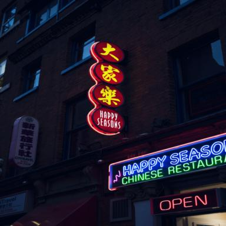
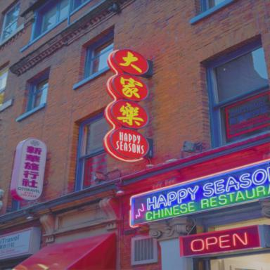
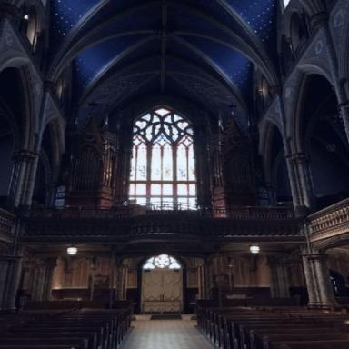
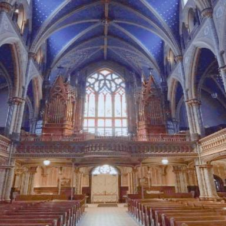

# RSEND: Retinex-based Squeeze and Excitation Network with Dark Region Detection for Efficient Low Light Image Enhancement

### News
* **2025.3.31：** Our paper has been accepted by IJCNN 2025. Code and Models will be released soon.

### Images Gallery

  
  
  
  

