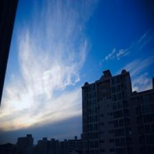
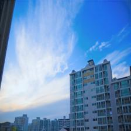

# RSEND: Retinex-based Squeeze and Excitation Network with Dark Region Detection for Efficient Low Light Image Enhancement

### News
* **2025.3.31：** Our paper has been accepted by IJCNN 2025. Code and Models will be released soon.


### Images Gallery
<div style="display: flex; justify-content: space-between;">
  
  
  
  
  
  
  
  
</div>

## Links

The models can be downloaded in this link [Models](https://drive.google.com/drive/u/2/folders/1o0io9kYurcI7bJ832Iei_2p58wetDGi6).

## Create Environment

```
git clone https://github.com/jeffconqueror/RSEND.git
conda create -n RSEND python=3.12
conda activate RSEND
cd RSEND
pip install -r requirements.txt
```

## To Fit a Model
```
python train.py --save_dir PATH_TO_SAVE_OUTPUT --train_dataset PATH_TO_TRAINING_DATASET --val_dataset PATH_TO_VALIDATION_DATASET --device DEVICE --epoch NUM_EPOCH --batch_size BATCH_SIZE
```

## To Test the Model
```
python test.py --save_dir PATH_TO_SAVE_OUTPUT --test_dataset PATH_TO_TEST_DATASET --device DEVICE --state_dict MODEL_PATH
```